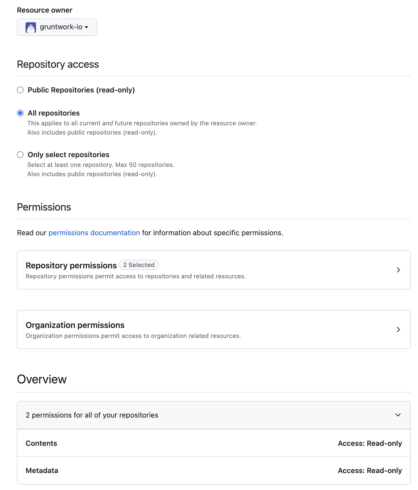
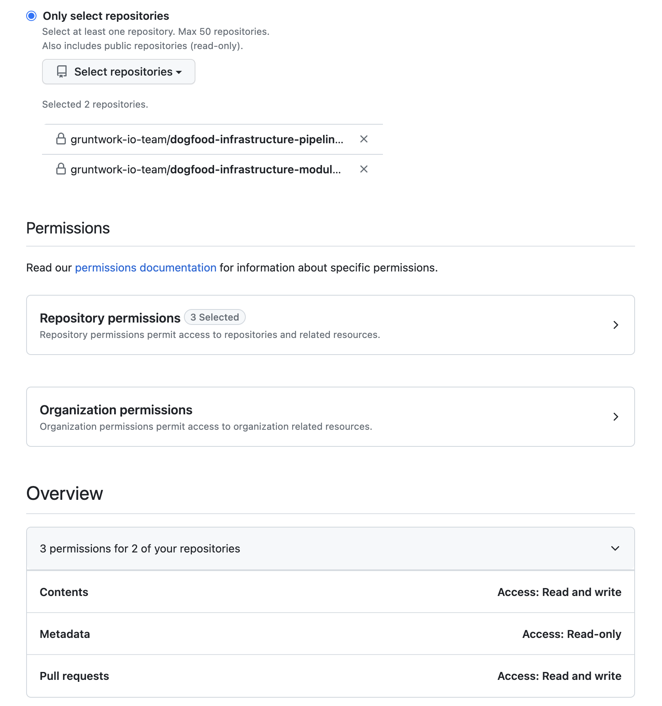

# Infrastructure Modules Template

This repository serves as a template to bootstrap your own `infrastructure-modules` repository by running a GitHub actions workflow. The resulting repository will be responsible for housing your reusable, testable, configurable and versioned pieces of infrastructure, which can be used to create infrastructure in your `infrastructure-live` repository.

> [!NOTE]
> This workflow solely generates the necessary files for initializing your `infrastructure-modules` repository. It **does not** create any infrastructure within your AWS account.

The workflow will generate the following:

- GitHub Actions example workflow for testing modules.
- A `modules` directory pre-populated with some example modules.
- README.md file with instructions on how to use the repository.

## Prerequisites

> [!NOTE]
> Skip steps 1 & 2 if you already have a GitHub Machine User and the required Personal Access Tokens.

Using the provided bootstrap workflow requires the following:

1. A GitHub Machine User, we'll refer to this user as `ci-user`, but you may name it anything you like
   1. Must be a member of your GitHub Org
   1. Must have permission to create PRs within your Org
   1. Be a member of your team in **Gruntwork's** GitHub Organization (See [instructions on inviting a user to your team](https://docs.gruntwork.io/developer-portal/invite-team#inviting-team-members) and [linking the user's GitHub Id to Gruntwork](https://docs.gruntwork.io/developer-portal/link-github-id))

1. GitHub Fine Grained [Personal Access Tokens(PAT)](https://docs.github.com/en/authentication/keeping-your-account-and-data-secure/managing-your-personal-access-tokens#fine-grained-personal-access-tokens) for the machine user `ci-user`:
   > [!WARNING]
   > Store all of these tokens somewhere safe (like a password manager) as they may be needed in other repository secrets.
   >

   1. `GRUNTWORK_CODE_ACCESS`. This token will be used to manage access to Gruntwork resources during GitHub Action runs.

        This token **must** have:
        - Content (read only) access to **Gruntwork**’s GitHub Organization

        

   1. `CUSTOMER_BOOTSTRAP_ACCESS`. The GitHub Actions `bootstrap.yml` workflow will use this token to create the pull requests in those repos.

        This token **must** have:

        - Content (read & write) access
        - Pull Requests (read & write) access
        - Workflow (read & write) access

      to your `infrastructure-pipelines` and `infrastructure-modules` repos in your GitHub Organization.

      > [!NOTE]
      > For security purposes, you should remove this token once the bootstrap workflow is complete.
      >
      

1. GitHub [Repository secrets](https://docs.github.com/en/actions/security-guides/using-secrets-in-github-actions#creating-secrets-for-a-repository).

   1. `GRUNTWORK_CODE_ACCESS_TOKEN`. This should be assigned the *`GRUNTWORK_CODE_ACCESS`* token generated in the previous step as its value.

   1. `CUSTOMER_BOOTSTRAP_ACCESS_TOKEN`. This should be assigned the *`CUSTOMER_BOOTSTRAP_ACCESS`* token generated in the previous step as its value.

### Workflow Inputs

The name of your `infrastructure-live` repository is required to run the workflow (defaults to `infrastructure-live`).

## Usage

Once all prerequisite steps are completed, follow these steps to bootstrap your `infrastructure-modules` repository:

1. Navigate to the **Actions** tab on your repository’s GitHub page.
1. Locate and select the **Infrastructure Modules Bootstrap** workflow from the available list.
1. Choose **Run Workflow** to initiate the process.
1. Complete the workflow form as prompted.
1. Select **Run Workflow** to execute the process.
1. Once the workflow is completed, navigate to the **Pull requests** tab on your repository’s GitHub page.
1. Select the pull request created by the workflow and merge it into your default branch.

> [!NOTE]
> Use the [infrastructure-live-template](https://github.com/gruntwork-io/infrastructure-live-template) repository if you have not already created an `infrastructure-live` repository.
